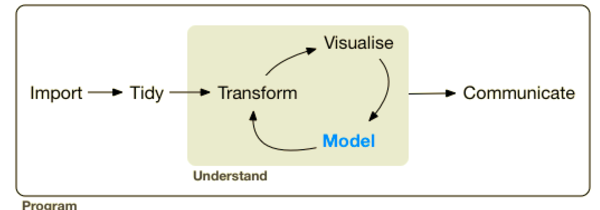

This is an [R Markdown](http://rmarkdown.rstudio.com) Notebook. When you execute code within the notebook, the results appear beneath the code. 

You can execute chunks by clicking the *Run* button within the chunk or by placing your cursor inside it and pressing *Cmd+Shift+Enter*. 





```{r}
# Import the Tidyverse
library(tidyverse)

# Load data ---------------------------

# Import data
titanic <- readr::read_csv("data/train.csv")

# Check out the first severl rows of your dataframe
titanic

```


```{r}
# Summarize titanic
summary(titanic)

```
```{r}
# Summarize titanic using a pipe
titanic %>%
  summary()

```
```{r}
# Summarize titanic after dropping na
titanic %>%
  drop_na() %>%
  summary()

```
```{r}
# Wrangling your data ---------------------------

# Subset to get all 'Male' rows
titanic %>% 
  filter(Sex == "male")

```
```{r}
# Subset to get all 'Female' rows
titanic %>%
  filter(Sex == "female")

```
```{r}
# Arrange by increasing Fare
titanic %>%
  arrange(Fare)

```


```{r}
# Arrange by decreasing Fare
titanic %>%
  arrange(desc(Fare))

```

```{r}
# Create new column fam_size (size of family)
titanic %>%
  mutate(fam_size = Parch + SibSp)

```


```{r}
# Create new column fam_size (size of family)
# Arrange by decreasing FamSize
titanic %>%
  mutate(fam_size = Parch + SibSp) %>%
  arrange(desc(fam_size))

```


```{r}
# Turn numerical values of Survived column to 'No' & 'Yes' (new dataframe)
titanic1 <- titanic %>%
  mutate(Survived = ifelse(Survived == 1, "Yes", "No"))

```


```{r}
# Plot data ---------------------------

# Plot barplot of passenger Sex
ggplot(titanic1, aes(Sex)) +
  geom_bar()

```


```{r}
# Plot barplot of passenger Sex & stack according to Survival
ggplot(titanic1, aes(Sex)) +
  geom_bar(aes(fill = Survived))

```


```{r}
# Scatter plot of Age vs Fare
ggplot(titanic, aes(x = Age, y = Fare)) +
  geom_point()

```


```{r}
# Scatter plot of Age vs Fare colored by Sex
ggplot(titanic, aes(x = Age, y = Fare, color = Sex)) +
  geom_point()

```


```{r}
# Scatter plot of Age vs Fare colored by Sex faceted by Survived
ggplot(titanic1, aes(x = Age, y = Fare, color = Sex)) +
  geom_point() +
  facet_wrap(~ Survived)

```


```{r}
# Summarize data ---------------------------

# Check out mean Fare
titanic %>% 
  summarize(meanFare = mean(Fare))

```


```{r}
# Check out mean Fare
titanic %>% 
  summarize(medianFare = median(Fare))

```


```{r}
# Check out mean Fare for men
titanic %>%
  filter(Sex == 'male') %>% 
  summarize(meanFare = mean(Fare))

```


```{r}
# Check out mean Fare for women
titanic %>%
  filter(Sex == 'female') %>% 
  summarize(meanFare = mean(Fare))

```


```{r}
# Check out mean Fare & number of survivors for women
titanic %>%
  filter(Sex == 'female') %>% 
  summarize(meanFare = mean(Fare),
            Survived = sum(Survived))

```


```{r}
# Check out mean Fare & number of survivors grouped by Sex
titanic %>% 
  group_by(Sex) %>% 
  summarise(meanFare = mean(Fare), 
            Survived = sum(Survived))

```

```{r}
# Check out mean Fare & number of survivors grouped by Sex
titanic %>% 
  group_by(Sex) %>% 
  summarise(meanFare = mean(Fare), 
            Survived = sum(Survived)/n())

```


